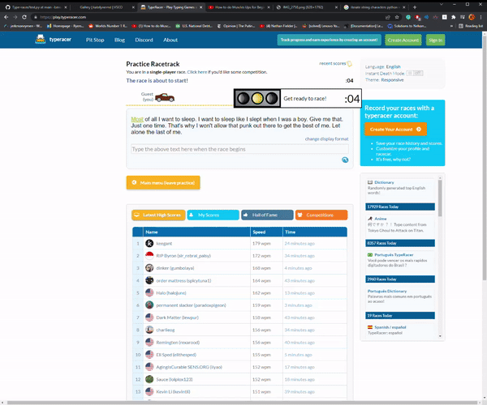

# Description
 Type racer script.
 Works by getting a screenshot of the textbox, converting the image to a string, and typing that string out.
 Implemented with pyautogui, pytesseract, open cv2.
 
 *Currently, uppercase letters are not recognized, so only 85% functionality*
  
